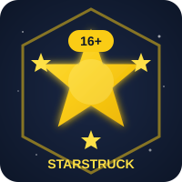

# ⭐ GitHub Achievements - Starstruck Collection

> Visual designs dan panduan untuk GitHub Achievements badges

## 🏆 Badge Designs

Koleksi visual designs untuk GitHub Achievements badges dalam format SVG dengan animasi.

### Badge yang Tersedia

| Badge | File | Deskripsi |
|-------|------|-----------|
| ⭐ Starstruck | `starstruck.svg` | 16+ stars di satu repo |
| 🦈 Pull Shark | `pull-shark.svg` | 2+ Pull Requests merged |
| 🚀 YOLO | `yolo.svg` | Merge tanpa review |
| 🧠 Galaxy Brain | `galaxy-brain.svg` | PR dengan 2+ review comments |
| 🎯 Quickdraw | `quickdraw.svg` | Close issue <5 menit |
| ❤️ Heart Commenter | `heart-comment.svg` | 10+ heart comments |
| 👥 Pair Extraordinaire | `pair-extraordinaire.svg` | PR dengan co-author |
| 🔐 Secret Santa | `secret-santa.svg` | GPG signed commits |

## 🎨 Preview

Buka file `index.html` untuk melihat showcase interaktif semua badges.

## 📖 Panduan Lengkap

Baca file `github-achievements-guide.md` untuk panduan detail membuka setiap badge.

## 🤖 Automation

Lihat script automation di repository utama:
[github.com/antono4/antono4](https://github.com/antono4/antono4)

## 👤 Profile

Dibuat oleh [Antono](https://github.com/antono4)

---

⭐ Starstruck Badge - Created by OpenHands AI Agent
